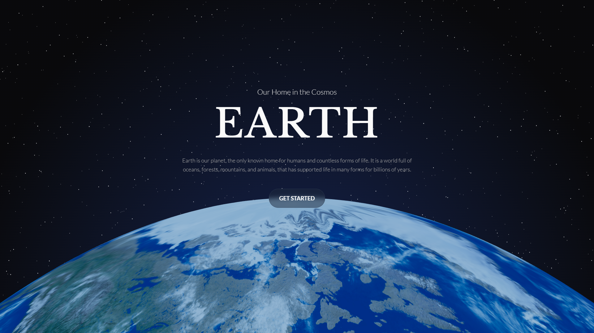

# Earth website

This project is an interactive, single-page landing website dedicated to planet Earth. Its core feature is a real-time 3D Earth model built with Three.js and React Three Fiber, embedded directly in the frontend using React and TypeScript. As users scroll through the page, the 3D globe responds with smooth animations: it changes position, rotation, scale, and distance from the camera into an engaging visual experience. The site presents general facts about Earth in a modern, clean UI

[**➥ Live**](https://oke225.github.io/earth-website/)

## ⚙️ Technologies

## ⭐ Features

- Scroll 3D animations
- 3D Earth model
- Responsive design
- Clean UI/UX
- Information sections about Earth

## 🔎 See Also

- [My Website](https://pj-portfolio-cv.vercel.app)
- [My GitHub profile](https://github.com/OKE225)
